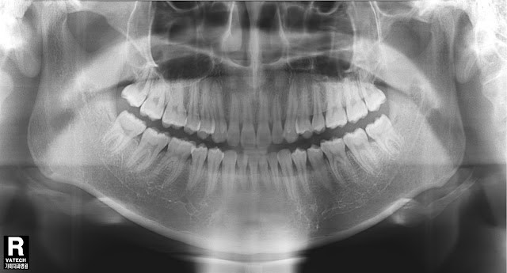

<p align="center">

<br>
<h1 align="center">Dental Cavity Detection</h1>

<p align="center">Detection of teeth anomalies </p>

<p align="center">
<a href="https://www.python.org/downloads/release/python-370/" target="_blank">
  
</a>
  
Keras implementation of VGG16 fine tuned model for hail damage detection.
------------

## Introduction :wave:
Dental caries or cavities, more commonly known as tooth decay, are caused by a breakdown of the tooth enamel. This breakdown is the result of bacteria on teeth that breakdown foods and produce acid that destroys tooth enamel and results in tooth decay. Early cavity detection can mean less damage, less pain & less hassle down the road. While preventing decay is always the primary goal, we understand that not everyone has perfect oral health all the time, so early detection & treatment are essential tools for preserving your beautiful smile! X-rays can show tooth decay, fillings and gum disease.

The goal of our project was to develop a model that can process a panoramic x ray image and can separate the teeth with caries from the healthy teeth. With this model we speed up the process of cavity detection, and we also enable patients to have access to these information  and be informed about their health.

## File github structure
  
#### File hierarchy
Once you download pretrained model and dataset, please follow this project structure:
```
  
    |── requirements.txt                      Dependencies 
    |── NotebookTrain.ipynb                   Training model
    |── NotebookPrediction.ipynb              Prediction script
```    

#### Dataset  
We croppied individual teeth from 116 panoramic x-ray images, afther that we were able to create 2 datasets with 420 images we needed in order to train our model. One dataset contains healthy theeth and the other containts theeth with caries. <br>
You can find the datasets we used to train our model [here](https://drive.google.com/drive/folders/1CJsVA3ggEg0lE_oS1dnnIE1OxWzOaeXV?usp=sharing).

#### Classification
We use binary classifier (cavity/no cavity) on detected objects

--------------------
# Phases of project implementation
### 📥 Phase 1: Dataset collection
In order to train a deep-learning model to classify whether a tooth is healty or with caries cavity, we needed an appropriate dataset with balanced distribution of images for the two classes:
  
📂	Healthy teeth / without caries <br>
📂	Teeth with Tooth decay / with caries

We use data from [Mendeley Data](https://data.mendeley.com/datasets/hxt48yk462/1). The dataset consists of anonymized and deidentified panoramic dental X-rays of 116 patients, taken at Noor Medical Imaging Center, Qom, Iran. The subjects cover a wide range of dental conditions from healthy, to partial and complete edentulous cases. From each image we cut each tooth separately and classified it into one of the groups. In the end, we got a set of 401 pictures of healthy teeth, and 400 pictures of teeth with caries, which we used further to train our model.
  
#### Preview of dataset

<p align="center">

  
| Class         | 1    | 2  | 3 |    
| ------------- | ------------- | ------------- | -------------| 
| Healthy teeth / without caries   |   |  | |
| Teeth with Tooth decay / with caries | | |  |

#### Dataset Preparation  
 We have expanded the size of a training dataset by creating modified versions of images in the dataset. The dataset was divided on **train 80% /test 10% /valid 10%** folders with python code.
  
Classes ratio by folder:
  
| Dataset         | Healthy teeth / without caries   | Teeth with Tooth decay / with caries  | Total| % |      
| ------------- | ------------- | -------------| -------------| -------------|
| Train   | 321 |320  | 641 | 79% |
| Valid | 80 | 80 | 160 | 19% |
| Test  | 5 | 5 | 10 | 2% |
| Total  | 406 | 405 | 811 | 100%|
  
### 💪 Phase 2: Training the model
To solve this problem, we used several pre-trained CNN models. The results are shown below:


| Model         | Epochs        | Loss  | Train Accuracy| Test Accuracy|      
| ------------- | ------------- | -------------| -------------| -------------|
| ResNet50   | 50          |10(-5)  | 97.00% | 89.00%|
| **VGG16 - Used Data Augumentation** | **80**  | **10(-5)** | **99.54%** | **90.68%**|
| MobileNetV2  | 100          |10(-5)  | 99.84% | 88.13%|
 
Best overall train and test accuracy results were achieved using VGG16. This model is pre-trained model of ImageNet dataset, and we have retrain in our data. 60% of  basic layers were frozen, and in the final output we add new layers.  This convolutional neural network  is considered to be an excellent vision model. *Train accuracy= 99.54% and test accuracy= 90.68%.* 
 
<p align="center">  


The learning curves for this model are shown in the figure below.
  

  
| Accuracy curve         | Loss curve    |     
| ------------- | ------------- |
|  |  |
  
  
### Best Validation performance on Synthetized Dataset

|precision|recall|f1-score|support|
|---|---|---|---|
| 0.89     | 0.93     | 0.91  |      81|
| 0.92   |   0.89  |    0.90        |80|

 
### Time Benchmark 
  * ~0.1s Inference Time on GPU (Tesla K80) 
 
During model training we used callback function for saving best modes weights. <br> The best model weights can be download from this link ([Link](https://drive.google.com/file/d/1FYmIUx9zbJ4QnUsQueO6O48U0SOfx93I/view?usp=sharing))
 

### ✔️ Phase 3: Detection of cavity in panoramic x-rays
This part of the project is still under construction 👷‍♀️

--------------------


##  Conclusion

## Future work
The purpose of this model is to save the time that dentists lose in reading the dental imaging. With this model, with the recording itself, they will receive a ready analysis and dentists will be able to immediately focus on the teeth that need to be repaired.

In Macedonia, especially in small places, X-rays are taken outside dental offices. Patients receive an X-ray, and then go to the dentist to read it. With this model, in addition to the x-ray image, they will receive an analysis, which will allow them to know if they have teeth that need to be repaired, how many and which teeth they are.

## 👧 Team Members 💪

- Teodora Mladenovska
- Ana Angelova
- Tanja Ivkovska
- Mihaela Miova


